# 🎬 Movie App

Aplikacja mobilna na Androida, stworzona z użyciem języka Kotlin, do przeglądania i wyszukiwania filmów, dodawania filmów na listę Ulubionych i wyszukiwania 

## ✨ Funkcje

- 🔐 System logowania i rejestracji
- 🎥 Przeglądanie popularnych filmów
- 🔍 Wyszukiwanie i zaawansowane filtry
- ⭐ Ulubione filmy
- 🖼️ Galeria zdjęć z filmów
- 🌤️ Pogoda i lokalizacja
- 🌙 Ciemny motyw

## 🛠️ Technologie

- **Kotlin** - język programowania
- **Android Studio** - IDE
- **Retrofit** - komunikacja z API
- **SQLite** - lokalna baza danych
- **Glide** - ładowanie obrazków
- **Coroutines** - programowanie asynchroniczne
- **Material Design** - interfejs użytkownika

## 📱 API

- [The Movie Database (TMDB)](https://www.themoviedb.org/)
- [OpenWeatherMap](https://openweathermap.org/)

## 🚀 Instalacja

1. Sklonuj repozytorium
2. Zbuduj projekt w Android Studio
3. Uruchom na urządzeniu/emulatorze

## 📸 Screenshoty

  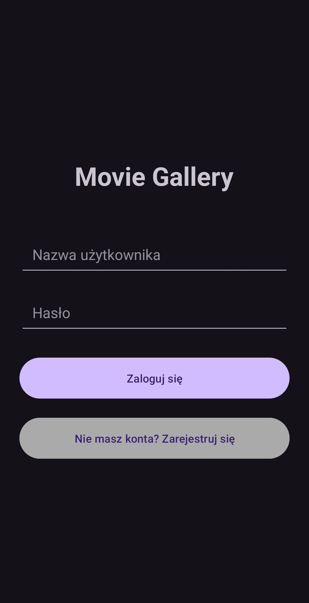
  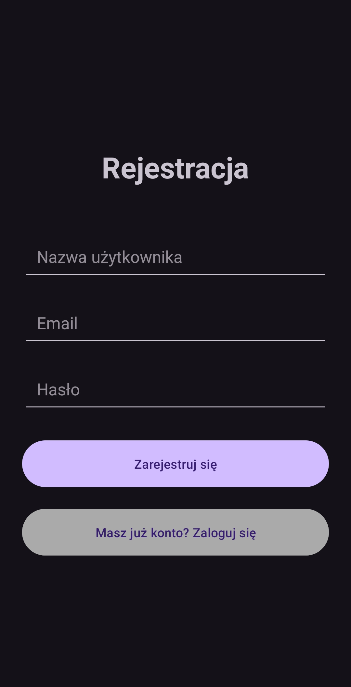
  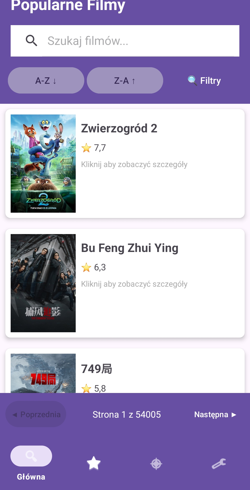
  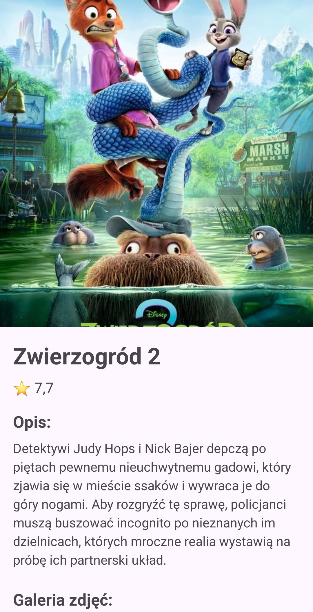
  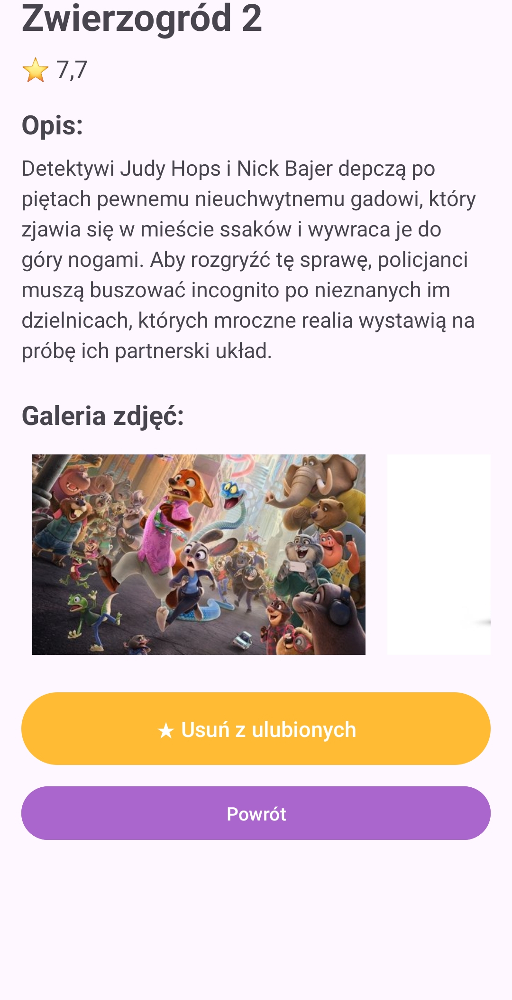

  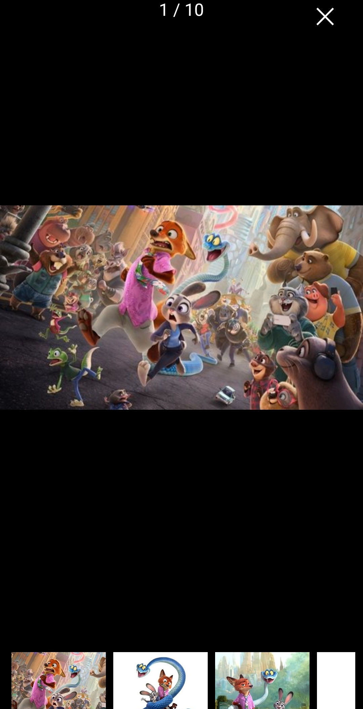
  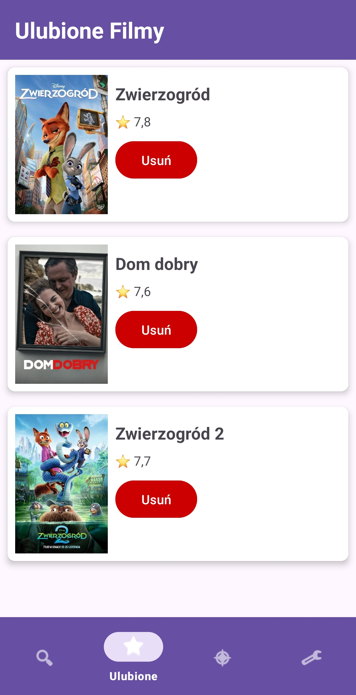
  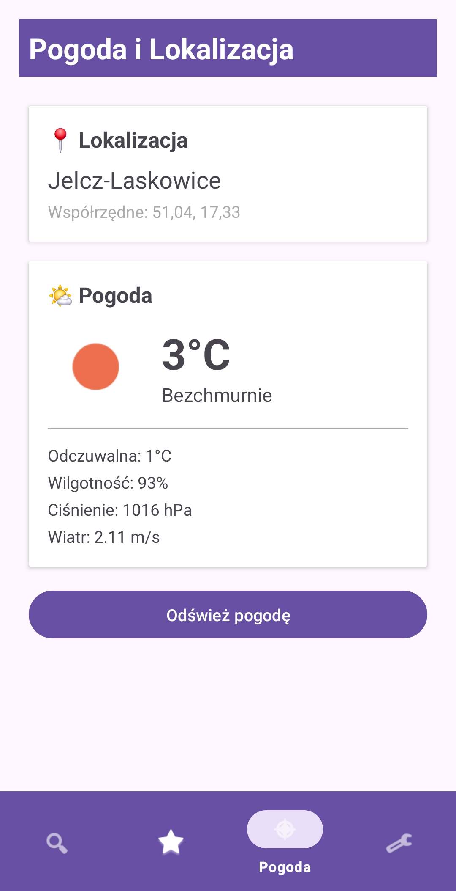
  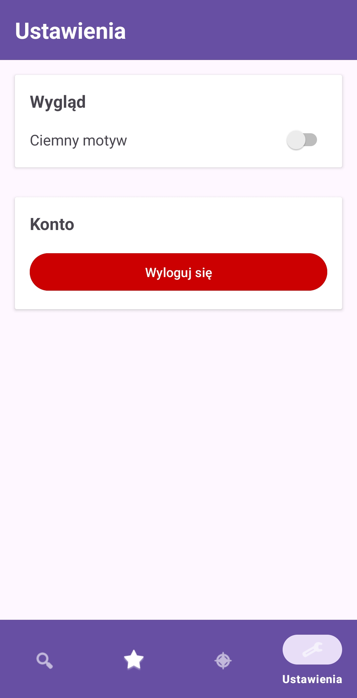
  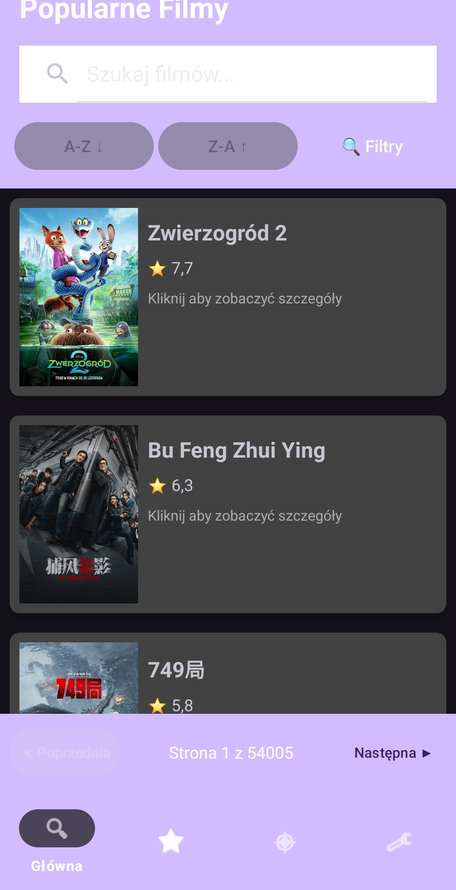
  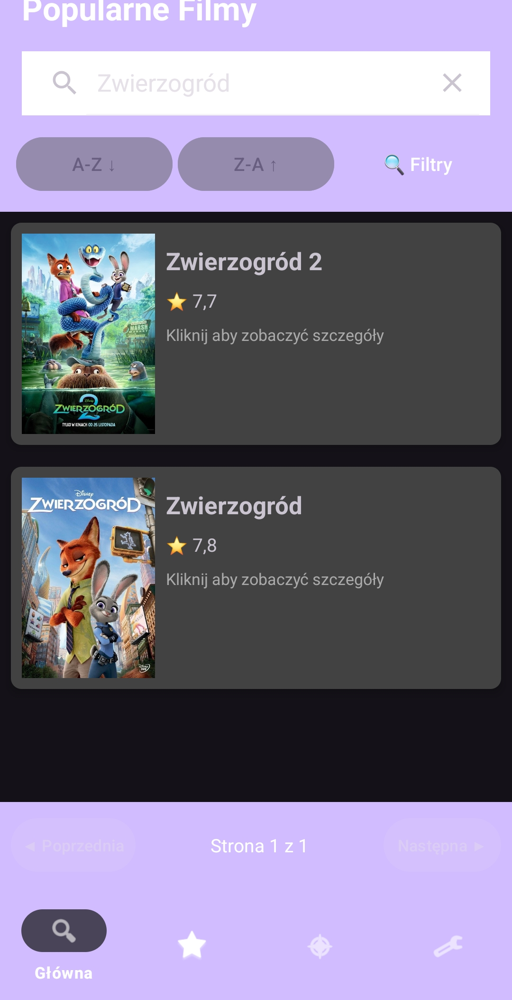

## 👤 Autor

Maksymilian Sokalski, nr albumu 86630
